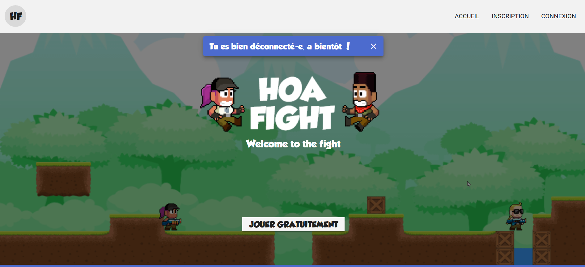
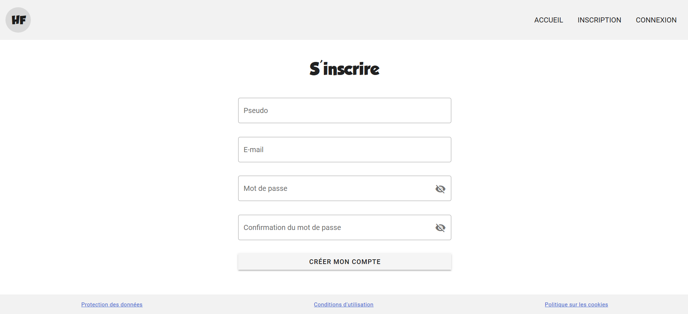
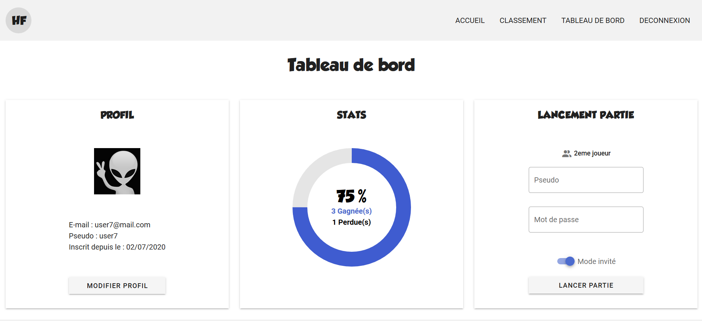
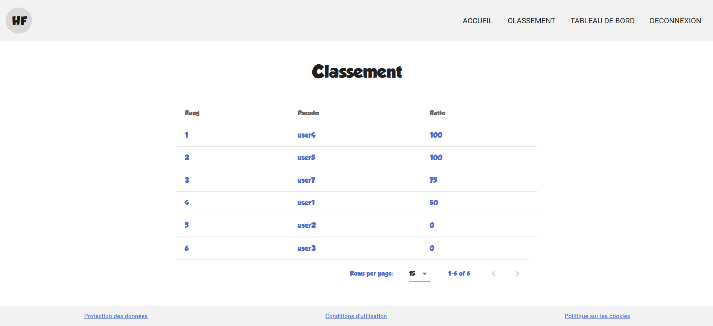
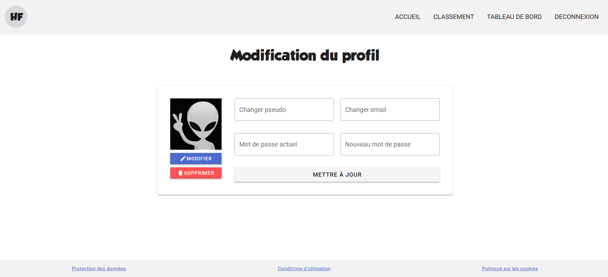
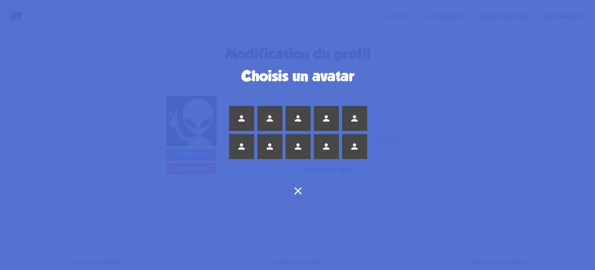

# Hoa Fight - The Website

#### A website from where you can : login/register (and delete your account), launch the game "Hoa Fight" (i.e repo hoa-fight-t), see your game stats and the general ranking of all the players registered.

The website is made using Vue.js (incl. Vuex, Vue Router and Vuei18n) + Vuetify for front end, and Express + a SQL database (MariaDB) for back end.
This is a project I presented as a final exam (along with the game) to get my web programming degree. 
The website is not online and will never be, it was for educational purpose only and is designed for local use only. 
However I'll make a version of the game that doesn't require access to the website.
I know that sources of projects made with Vue.js + Express + SQL (I did not use any ORM for the queries) are not that common out there (NoSQL everywhere) so maybe it will be useful to someone looking for examples with this stack.

